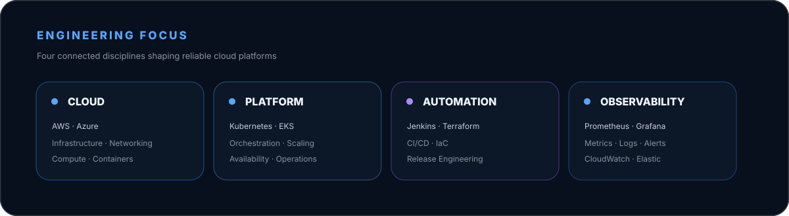
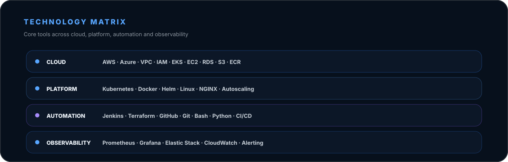
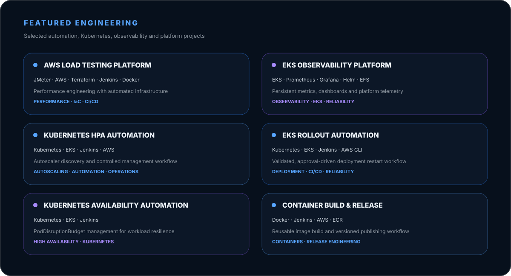
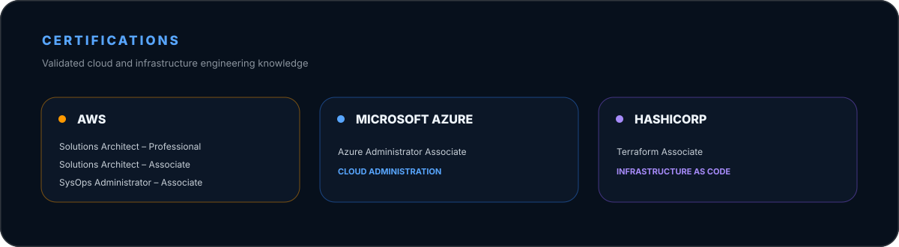

 

  

  

  

### Explore the projects

| Project | Repository |
|---|---|
| ⚡ AWS Load Testing Platform | [Open project →](https://github.com/ChaminduAttanayaka/jmeter-aws-load-testing-platform) |
| 📊 EKS Observability Platform | [Open project →](https://github.com/ChaminduAttanayaka/Observability-on-AWS-EKS-Fargate) |
| ⎈ Kubernetes HPA Automation | [Open project →](https://github.com/ChaminduAttanayaka/jenkins-kubernetes-hpa-manager) |
| 🔄 EKS Rollout Automation | [Open project →](https://github.com/ChaminduAttanayaka/jenkins-eks-rollout-restart) |
| 🛡️ Kubernetes Availability Automation | [Open project →](https://github.com/ChaminduAttanayaka/jenkins-eks-poddisruptionbudget-manager) |
| 📦 Container Build & Release | [Open project →](https://github.com/ChaminduAttanayaka/jenkins-ecr-docker-image-builder) |

 

  

### GitHub Activity

  

  

 

