 

 

[Load Testing](https://github.com/ChaminduAttanayaka/jmeter-aws-load-testing-platform) ·
[EKS Observability](https://github.com/ChaminduAttanayaka/Observability-on-AWS-EKS-Fargate) ·
[HPA Automation](https://github.com/ChaminduAttanayaka/jenkins-kubernetes-hpa-manager) ·
[Rollout Automation](https://github.com/ChaminduAttanayaka/jenkins-eks-rollout-restart) ·
[PDB Automation](https://github.com/ChaminduAttanayaka/jenkins-eks-poddisruptionbudget-manager) ·
[Container Build](https://github.com/ChaminduAttanayaka/jenkins-ecr-docker-image-builder)

